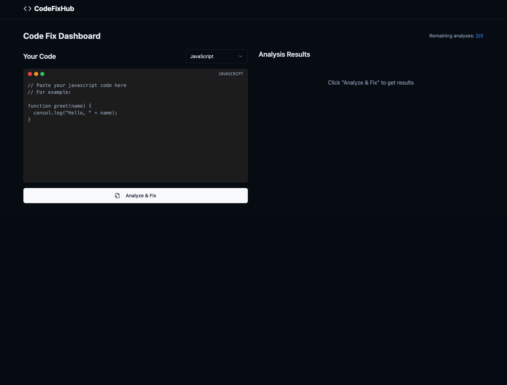

# CodeFixHub

**CodeFixHub** is an AI-powered code analyzer that instantly finds and fixes bugs in your code, while also explaining the fixes in clear language. Built for developers who want faster debugging and cleaner code across multiple programming languages.



---

## 🚀 Features

- 🧠 **AI-Powered Debugging** — Analyze and correct code issues using OpenAI's GPT-4.
- 💬 **Clear Explanations** — Get human-readable summaries of what was fixed and why.
- 🖥️ **Multi-Language Support** — Supports Python, JavaScript, Java, and more.
- 💡 **Simple Interface** — Clean frontend UI for instant code analysis.
- 💳 **One-Time Payment Option** — Unlock unlimited access with a single payment.

---

## 🛠️ Tech Stack

- **Frontend**: HTML, CSS, JavaScript
- **Backend**: FastAPI (Python)
- **AI Engine**: OpenAI GPT-4 via `openai` API
- **Environment Management**: `python-dotenv`

---

## ⚙️ Getting Started (Local Setup)

1. **Clone the repo**

```bash
git clone https://github.com/Martimic10/CodeFixHub.git
cd CodeFixHub

#Create .env file with your API Keys
OPENAI_API_KEY=your_openai_api_key_here

#Install Dependencies
cd backend
pip install -r requirements.txt

#Run the backend server
uvicorn app.main:app --reload

Project Structure
CodeFixHub/
├── backend/
│   ├── app/
│   │   ├── main.py
│   │   ├── routes.py
│   │   └── services/
│   │       └── ai_service.py
│   ├── .gitignore
│   ├── .env.example
│   └── requirements.txt
├── frontend/
│   ├── index.html
│   ├── dashboard.html
│   ├── styles.css
│   ├── app.js
│   └── assets/
│       └── logo-light.png
├── .gitignore
├── README.md
└── LICENSE (optional)

License
licensed under the MIT License. See License for details.
